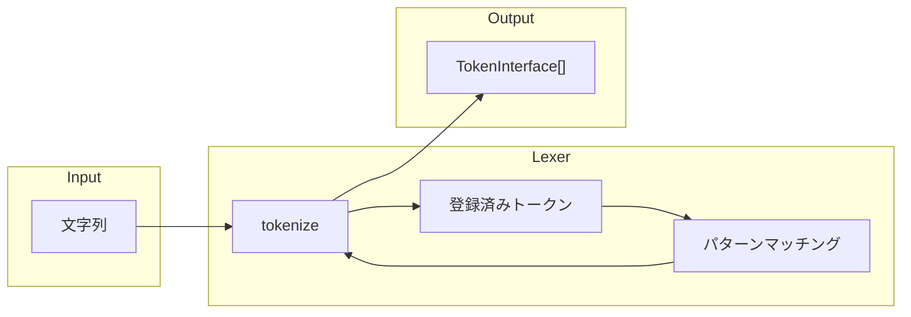
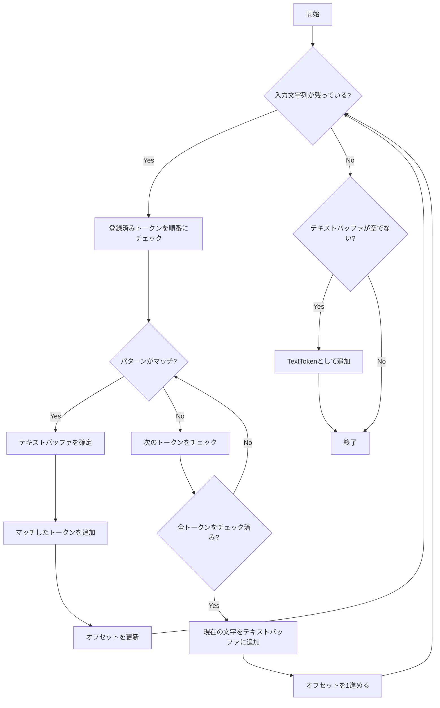
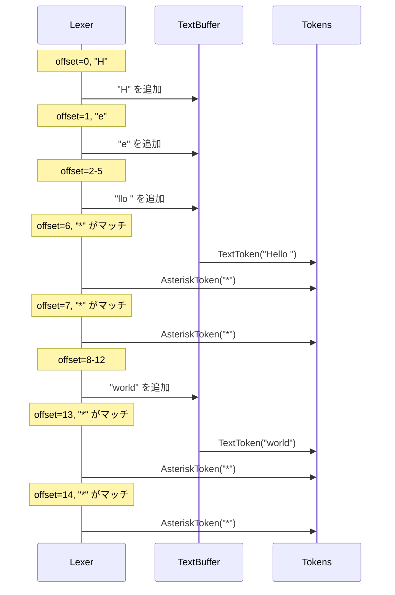
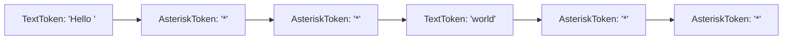

# Lexer - 字句解析器の仕組み

このドキュメントでは、マークアップ SDK の Lexer（字句解析器）処理について解説します。

## 全体アーキテクチャ

Lexer は入力文字列を**トークン**と呼ばれる最小単位に分割します。トークンはパーサーが解析しやすい形式に変換された文字列の断片です。



## 各クラスの役割

### Lexer

入力文字列をトークンの配列に変換するメインクラス。

| メソッド           | 機能                       |
| ------------------ | -------------------------- |
| `registerToken()`  | 単一のトークンを登録       |
| `registerTokens()` | 複数のトークンを一括登録   |
| `tokenize()`       | 文字列をトークン配列に分割 |

### TokenInterface

すべてのトークンが実装するインターフェース。

| メソッド           | 機能                                           |
| ------------------ | ---------------------------------------------- |
| `getPattern()`     | トークンを抽出するための正規表現パターンを返す |
| `getValue()`       | トークンの実際の値（文字列）を返す             |
| `setValue()`       | トークンの実際の値（文字列）を設定する         |
| `getDescription()` | トークンの説明を返す                           |

### AbstractToken

`TokenInterface` の基本実装を提供する抽象クラス。`getValue()` と `setValue()` の共通実装を持ちます。

## トークン一覧

現在実装されているトークンの一覧です。

| トークンクラス  | パターン | 説明                               |
| --------------- | -------- | ---------------------------------- |
| `AsteriskToken` | `/^\*/`  | アスタリスク（`*`）記号            |
| `HashToken`     | `/^#/`   | ハッシュ（`#`）記号                |
| `HyphenToken`   | `/^-/`   | ハイフン（`-`）記号                |
| `SpaceToken`    | `/^ /`   | スペース記号                       |
| `NewlineToken`  | `/^\R/`  | 改行文字（`\n`, `\r\n` など）      |
| `TextToken`     | なし     | 上記以外の文字列（フォールバック） |

## tokenize の処理フロー



### 処理の詳細

1. **パターンマッチング**: 登録されたトークンのパターンを順番に試行
2. **テキストバッファ**: マッチしない文字は一時的にバッファに蓄積
3. **TextToken 生成**: 記号が見つかった時点でバッファの内容を `TextToken` として確定
4. **トークン複製**: マッチしたトークンは `clone` して値を設定

## 具体例

### 入力

```
Hello **world**
```

### トークン化の過程



### 出力



## 拡張性

新しいマークアップ記号を追加する場合は、**新しいトークンクラスを実装して登録するだけ**で対応できます。

```php
// 新しいトークンを実装
class TildeToken extends AbstractToken
{
    public function getPattern(): string
    {
        return '/^~/';
    }

    public function getDescription(): string
    {
        return 'チルダ(~)記号のトークン';
    }
}

// Lexer に登録
$lexer->registerToken(new TildeToken());
```

### 注意点

- トークンの登録順序が重要です。先に登録されたトークンが優先的にマッチします
- `TextToken` は特殊なトークンで、パターンを持たず、他のトークンにマッチしなかった文字列を収集します
- 正規表現パターンは必ず `^`（文字列の先頭）から始める必要があります
