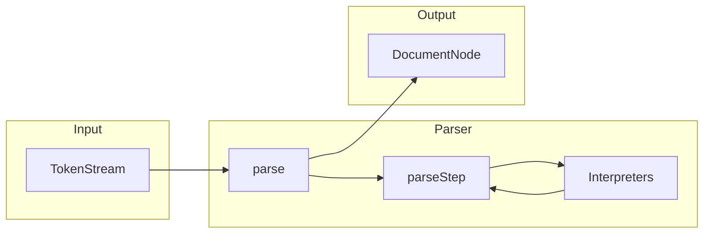
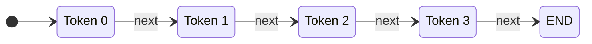
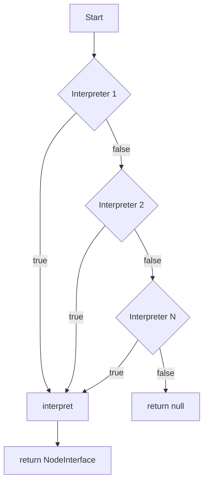
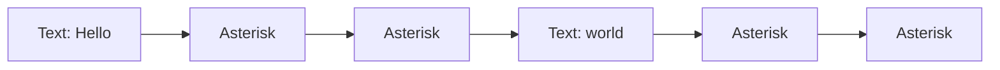
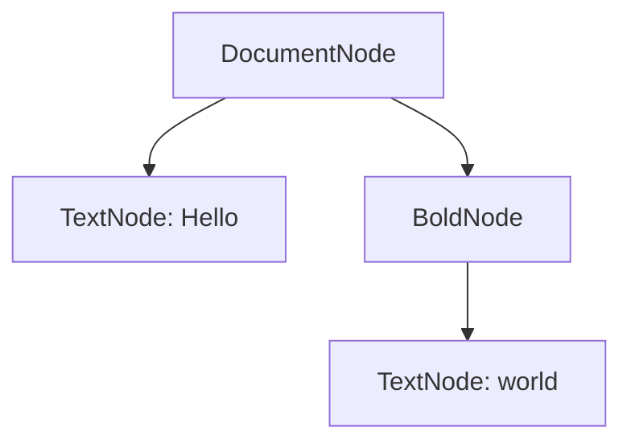

# Parser - パーサーの仕組み

このドキュメントでは、マークアップ SDK のパーサー処理について解説します。

## 全体アーキテクチャ

パーサーは**インタプリタパターン**を使用した拡張可能な設計になっています。



## 各クラスの役割

### TokenStream

Lexer が生成したトークンの配列を、順次アクセス可能なストリームとしてラップします。

| メソッド        | 機能                                               |
| --------------- | -------------------------------------------------- |
| `current()`     | 現在位置のトークンを取得                           |
| `peek($offset)` | カーソルを進めずに先のトークンを覗き見る（先読み） |
| `next()`        | カーソルを 1 つ進める                              |
| `isEnd()`       | ストリームの終端に達したかチェック                 |



- `peek(1)` で Token 2 を先読み
- `peek(2)` で Token 3 を先読み

### Parser

複数のインタプリタを管理し、トークンストリームを解析して AST（抽象構文木）を構築するメインクラス。

**インタプリタの優先度管理**:

- インタプリタは優先度（`getPriority()`）の降順でソートされる
- 優先度が高いインタプリタが先にマッチ判定される
- 例: `BoldInterpreter`（優先度 100）は `TextInterpreter`（優先度 0）より先に判定



### ParserContext

インタプリタが**再帰的にパース**を行うためのヘルパークラス。

マークアップは入れ子構造を持つため（例: `**bold _italic_ text**`）、インタプリタ内部から再度パーサーを呼び出す必要があります。

| メソッド               | 機能                                               |
| ---------------------- | -------------------------------------------------- |
| `parseNext()`          | 次のノードを 1 つ解析して返す                      |
| `parseUntil(callable)` | 条件を満たすまで解析を繰り返し、ノードの配列を返す |

## 具体例

### 入力

```
Hello **world**
```

### トークン化後



### 解析結果（AST）



## 拡張性

この設計により、新しいマークアップ構文を追加する場合は**新しいインタプリタを実装して登録するだけ**で対応できます。

```php
// 新しいインタプリタを実装
class StrikethroughInterpreter implements InterpreterInterface
{
    public function getPriority(): int { return 100; }
    public function canInterpret(TokenStream $stream): bool { /* ~~ を検出 */ }
    public function interpret(TokenStream $stream, ParserContext $context): NodeInterface { /* ... */ }
}

// パーサーに登録
$parser->registerInterpreter(new StrikethroughInterpreter());
```
